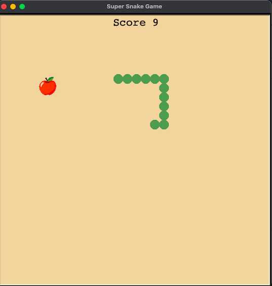

# Snake Game

Esse game foi desenvolvido durante o curso da Angela Yu - 100 Days of Code - The Complete Python Pro Bootcamp for 2021.

Customizei o jogo para que ficasse com a aparência que desejava, com dois tipos
de alimentos, e dificuldades referentes a velocidade.

